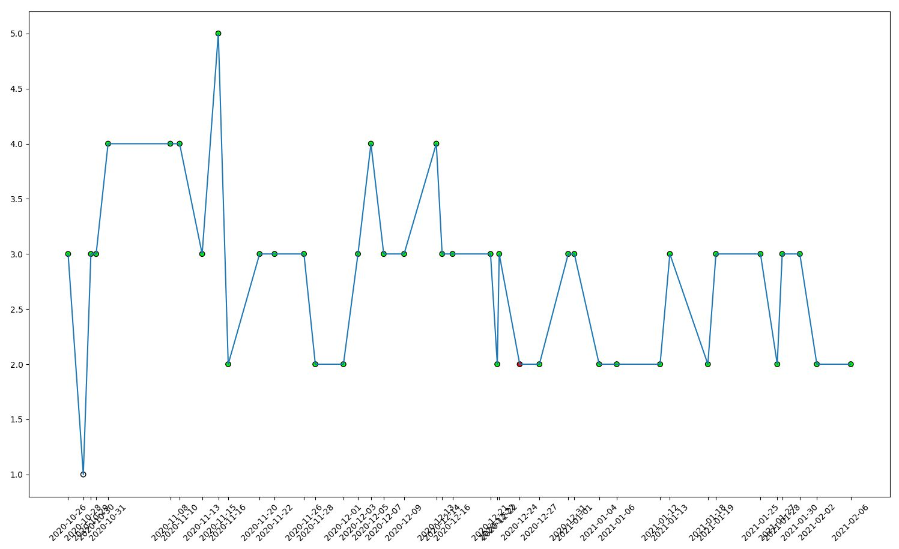

# headache

## Install

[Python 3](https://python.org/)  

### env

|       Variable       |  Type  |                                        Value
|----------------------|--------|----------------------------------------------------------------------------------------------|
|`DISCORD_TOKEN`       | `str`  | discord user or bot token, [discord developer portal](https://discord.com/developers)        |
| `DATABASE_URL`       | `str`  | postgres [connection URI](https://www.postgresql.org/docs/current/libpq-connect.html#LIBPQ-CONNSTRING) `postgres://{user}:{password}@{hostname}:{port}/{database-name}` |

### src/config.py

|     Key      |  Type  |                         Value                              |
|--------------|--------|------------------------------------------------------------|
| `prefix`     | `str`  | bot command prefix                                         |
| `bot`        | `bool` | user or bot token?                                         |

## commands

|   cmd     |                  args                     |         description            |
|-----------|-------------------------------------------|--------------------------------|
| `add`     | `<points> <med>`                          | add plot note                  |
| `plot`    |                                           | generate plot image            |
